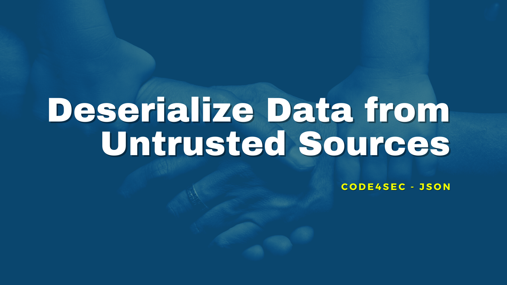

## Welcome to 4th episode of my series **Code for Security**.  

  
  
  
Previously on my episode, we talk about vulnerability in yaml.load(), the one of most famous data-loader functions. Today I will exploiting about **Data deserialization** via **pickle** which provides for efficient binary deserialization and loading of Python datatypes but **inherently risky** if serialized data is tampered with.  
    
## Misuse of pickle  
**pickle()** is function to dump live Python objects into an octet stream for storage or transmission, then reconstruct them back to possibly another instance of Python.  
  
pickle allows arbitrary objects to declare how they should be pickled by defining a __reduce__ method, which should return either a string or a tuple describing how to reconstruct this object on unpacking. In the simplest form, that tuple should just contain
> - A callable (which must be either a class, or satisfy some other, odder, constraints), and A tuple of arguments to call that callable on.  
> - Pickle will pickle each of these pieces separately, and then on unpickling, will call the callable on the provided arguments to construct the new object.  
And so, we can construct a pickle that, when un-pickled, will execute /bin/sh, as follows:  
  

  
 
  
The reconstruction step is inherently risky if serialized data is tampered with. It is possible to construct malicious pickle data which will execute arbitrary code during unpickling. ***The insecurity of Pickle is well recognized and clearly noted in Python documentation***.  
  
## Solution
**DO NOT USE pickle()** to un-pickle the data from an untrusted sources.  
Try to use **[JSON](https://docs.python.org/3/library/json.html#module-json)** module that does not in itself create an arbitrary code execution vulnerability.
  
**Another secure function is done!** Secured coding is just a flipped hand when you know the hint!

Let's hunt more vulnerable code to make **Code for Security** next episode. Stay tuned!  
  
**#JSON #Code4Sec**  
  
Credit/Ref:  
[Nelson Elhage](https://blog.nelhage.com/2011/03/exploiting-pickle/)
[python.org](https://docs.python.org/3/library/pickle.html)
  
______________________________
<table border="0">
 <tr>
   <td> <h3><i>Although my profile picture is quiet, but the real me can make some noise.</i></h3>
      

      <b> Author: Vuttawat Uyanont </b>   
      <i>Sexiest former engineer & banker who interested in Tech, Sake, and Beer.</i>   
      <b>Studying:</b> Master Computer Science in Cybersecurity Management at Mahanakorn University.    </td>  
   <td></td>  
 </tr>
</table>
  
